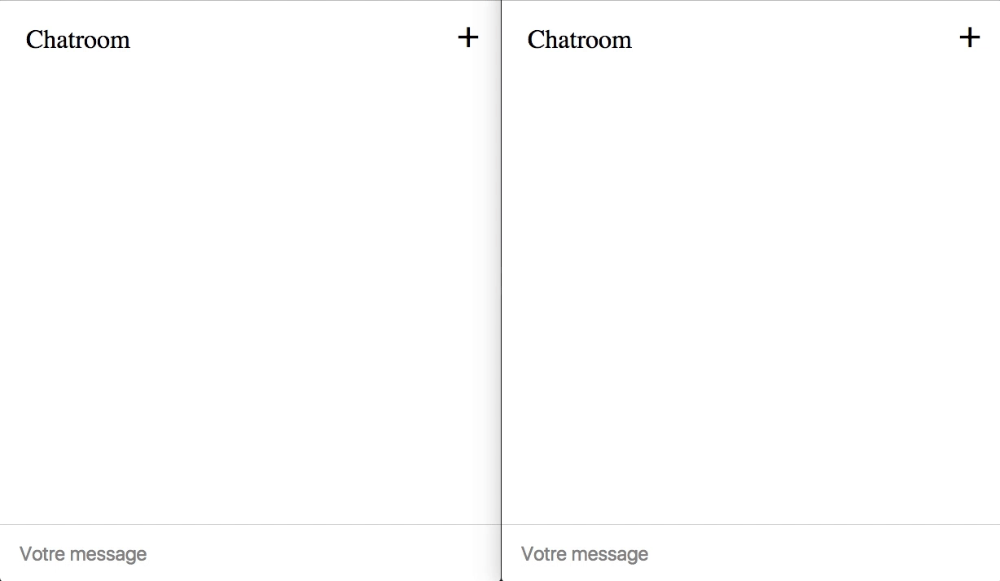

# Challenge Chatroom

Une salle de chat en NodeJS + React + Redux :scream:

## Résultat attendu

* On peut envoyer un message à tous les navigateurs connectés.

* On peut changer de pseudo.

Voici l'application, lancée dans deux onglets différents mis côte-à-côte.  
(Vous pouvez essayer de faire plus joli, ça devra pas être difficile :grin:)




## Back : NodeJS

### Serveur

La partie NodeJS est déjà prête, dans le dossier `server/`.  

Le script `yarn start:node` permet de lancer le serveur.  
Le script `yarn start:brunch` que vous pouvez lancer dans un autre terminal permet de lancer le watch.

Vous pouvez ensuite lancer votre navigateur sur `localhost:3000`.

### Websocket

Le serveur utilise Socket.io pour réceptionner et renvoyer les requêtes à tous les clients connectés.
Le front doit envoyer au serveur un objet, et le serveur le renverra tel quel à tous les fronts
connectés, en rajoutant un `id` unique à chaque message.

Par exemple :

1. J'envoie un objet au serveur :
```js
{
  user: 'Perceval',
  message: 'Je suis souvent victime des colifichets',
}
```

2. Le serveur renverra à tous les clients connectés :
```js
{
  user: 'Perceval',
  message: 'Je suis souvent victime des colifichets',
  id: 14,
}
```

3. Un autre client envoie un message :
```js
{
  user: 'Arthur',
  message: 'Je comprends rien',
}
```

4. Le serveur renverra à tous les clients connectés :
```js
{
  user: 'Arthur',
  message: 'Je comprends rien',
  id: 15,
}
```

---

## Front : React & Redux

### React

Vous savez faire, rien à signaler :smiley:  
Seul conseil que je peux vous donner si vous ne savez pas comment commencer :
vous pouvez partir sur 4 composants : `<App />`, `<Messages />`, `<Form />`, `<Settings />`.

### Redux

Pour envoyer et recevoir les requêtes au serveur, nous allons nous développer un middleware.

Afin de pouvoir activer à la fois le middleware Redux Dev Tools, ainsi que notre propre
middleware, nous devons utiliser la fonction `compose` de `redux`.

Sachant qu'on ajoute uniquement les Dev Tools quand l'extension est reconnue,
on a recours à une astuce : on stocke les Dev Tools dans un array, pour ensuite
décomposer l'array en argument de la fonction compose. Cela donc décomposera
l'extension si elle existe, ou ça ne décomposera rien si elle n'existe pas.

```js
/*
 * Npm import
 */
import { applyMiddleware, compose, createStore } from 'redux';


/*
 * Local import
 */
import reducer from '...';
import socket from '...';


/*
 * Code
 */
// Redux DevTools extension
let devTools = [];
if (window.devToolsExtension) {
  devTools = [window.devToolsExtension()];
}

// Middlewares
const socketMiddleware = applyMiddleware(socket);
const middlewares = compose(socketMiddleware, ...devTools);

// Store
const store = createStore(reducer, middlewares);


/*
 * Export default
 */
export default store;
```

### WebSocket

Dans ce middleware, vous devez créer une variable qui va recevoir l'instance
de la connexion WebSocket.

```js
let socket;
```

Ensuite, dans le middleware, vous pouvez écouter une action, (par ex. `'WEBSOCKET_CONNECT'`)
qui déclenchera la connexion. On pourra dispatcher cette action au chargement de la page,
par exemple dans le `componentWillMount` de <App /> ou juste après le render de ReactDOM.

Pour déclencher la connexion, on peut utiliser la variable locale `io`.  
Ensuite, on peut définir un écouteur d'évènement avec `.on()` pour dispatcher
une action lorsque l'on réceptionne un message du serveur :

```js
case WEBSOCKET_CONNECT:
  socket = window.io();
  socket.on('send_message', (message) => {
    store.dispatch(receiveMessage(message));
  });
```

OK pour réceptionner, mais il nous faut aussi pouvoir envoyer un message.
Pour cela, même stratégie : on peut dispatcher une action qui sera écoutée
par le middleware, et dans lequel on pourra envoyer un message via l'instance
`socket`, en utiliser la méthode `.emit()`.

```js
case MESSAGE_SEND:
  // ...
  socket.emit('send_message', message);
```

---

Il ne reste plus qu'à vous lancer ! :muscle:
